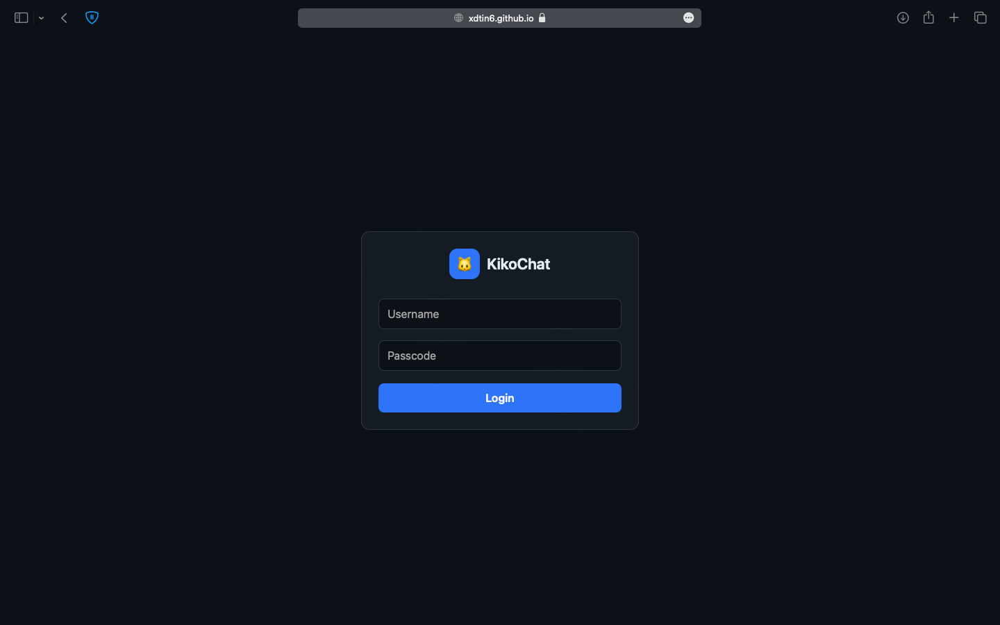
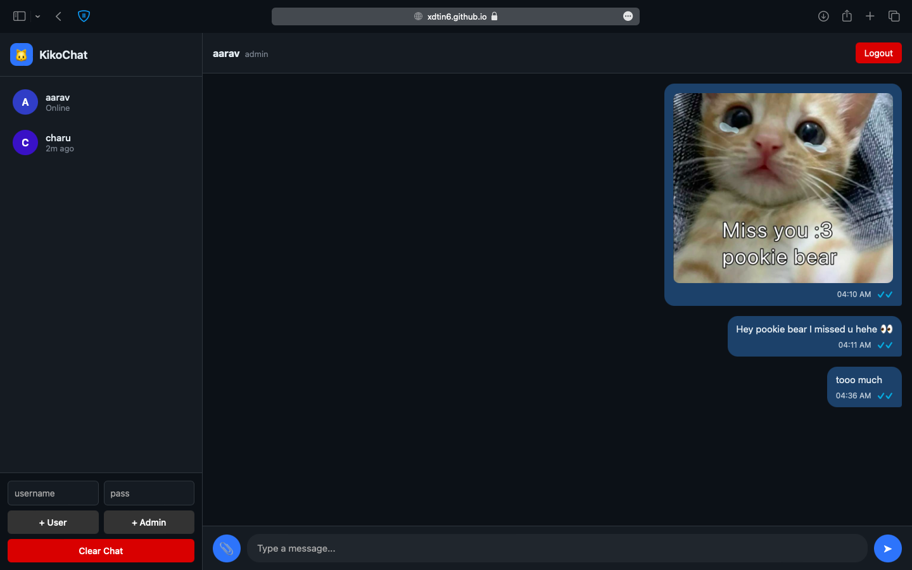
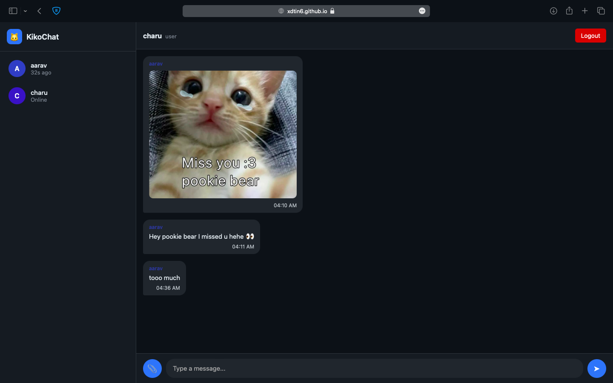

# 🐱 KikoChat

KikoChat is a **modern real-time chat web app** built with **Firebase Realtime Database** and deployed on **GitHub Pages**.  
It’s designed with a **WhatsApp-like experience** plus extra admin features — all wrapped in a **beautiful glassmorphism UI** with animated backgrounds.  

---

## ✨ Features

- 🔑 **Login system**  
  - Users log in with a **username + passcode**.  
  - Admin has the ability to **create new users** or **admins** directly from the interface.  

- 👤 **User Presence & Status**  
  - Shows **online status** or **last seen**.  
  - Each user gets a **unique avatar color**.  

- 💬 **Messaging**  
  - Send **text messages** in real time.  
  - Send and view **images & videos**.  
  - **Read receipts** (✓ = delivered, ✓✓ = seen, blue for seen).  

- 🧹 **Admin Controls**  
  - Clear all chats (requires admin authentication).  
  - Create new user accounts with username + passcode.  

- 🎨 **UI/UX**  
  - Animated **gradient background**.  
  - **Glassmorphism panels** (frosted look).  
  - **Responsive design**:  
    - **Desktop/Laptop** → Sidebar with user list + chat panel.  
    - **Mobile** → Chat-only interface (like WhatsApp).  
  - Cute **🐱 bouncing logo** for branding.  

---

## 📸 Screenshots

### 🔐 Login Page


### 💬 Admin Chat Page

### 💬 User Chat Page


---

## 🚀 Tech Stack

- **Frontend**: HTML, CSS (Glassmorphism, responsive), Vanilla JS  
- **Backend**: Firebase Realtime Database (authentication + chat storage)  
- **Hosting**: GitHub Pages  

---

## 🛠️ Setup

1. Clone this repo:  
   ```bash
   git clone https://github.com/your-username/kikochat.git
