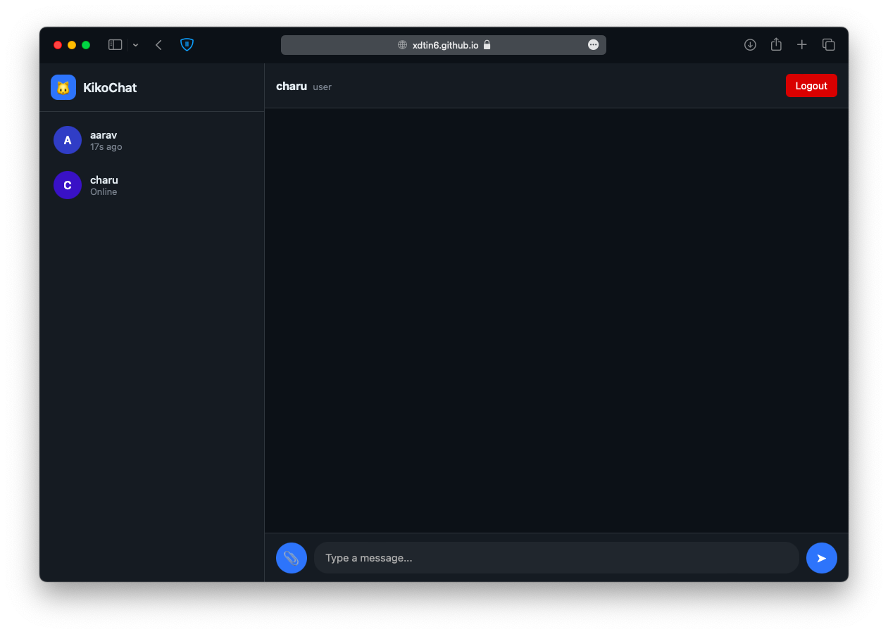

# 🐱 KikoChat

KikoChat is a **modern real-time chat web app** built with **Firebase Realtime Database** and deployed on **GitHub Pages**.  
It’s designed with a **WhatsApp-like experience** plus extra admin features — all wrapped in a **beautiful glassmorphism UI** with animated backgrounds.  

---

## ✨ Features

- 🔑 **Login system**  
  - Users log in with a **username + passcode**.  
  - Admin has the ability to **create new users** or **admins** directly from the interface.  

- 👤 **User Presence & Status**  
  - Shows **online status** or **last seen**.  
  - Each user gets a **unique avatar color**.  

- 💬 **Messaging**  
  - Send **text messages** in real time.  
  - Send and view **images & videos**.  
  - **Read receipts** (✓ = delivered, ✓✓ = seen, blue for seen).  

- 🧹 **Admin Controls**  
  - Clear all chats (requires admin authentication).  
  - Create new user accounts with username + passcode.  

- 🎨 **UI/UX**  
  - Animated **gradient background**.  
  - **Glassmorphism panels** (frosted look).  
  - **Responsive design**:  
    - **Desktop/Laptop** → Sidebar with user list + chat panel.  
    - **Mobile** → Chat-only interface (like WhatsApp).  
  - Cute **🐱 bouncing logo** for branding.  

---

## 📸 Screenshots

### 🔐 Login Page


### 💬 Admin Chat Page

### 💬 User Chat Page


---

## 🚀 Tech Stack

- **Frontend**: HTML, CSS (Glassmorphism, responsive), Vanilla JS  
- **Backend**: Firebase Realtime Database (authentication + chat storage)  
- **Hosting**: GitHub Pages  

---

## 🛠️ Setup

### 1. Clone this repo:  
   ```bash
   git clone https://github.com/your-username/kikochat.git

### 2. Setup Firebase

1. Go to [Firebase Console](https://console.firebase.google.com/)
2. Click **Add Project** → give it a name (e.g., `kiko-chat`)
3. Enable **Realtime Database**

   * Go to **Build → Realtime Database** → Create Database
   * Select **Start in test mode** (or set custom security rules later).
4. Enable **Firebase Storage**

   * Go to **Build → Storage** → Create a default bucket
   * Allow read/write for testing (or configure secure rules).
5. Add a **Web App** to your project:

   * Go to **Project Settings → Your Apps → Web App**
   * Copy the **Firebase Config** (API Key, Auth Domain, Database URL, Storage Bucket, etc.).
   * Replace the `firebaseConfig` inside `index.html` with your values.

### 3. Run Locally

Open `index.html` in your browser (no server needed since Firebase SDK works client-side).

### 4. Deploy to GitHub Pages

1. Commit your changes:

   ```bash
   git add .
   git commit -m "Initial commit of KikoChat"
   git push origin main
   ```
2. Go to your GitHub repo → **Settings → Pages**
3. Under **Branch**, select `main` and folder `/ (root)` → Save
4. Your site will be live at:

   ```
   https://your-username.github.io/kikochat/
   ```

---

## 🔒 Firebase Security Rules (Recommended)

For **production**, you should restrict access so only authenticated users (those created by you via username + passcode) can read/write data.

### Realtime Database Rules

```json
{
  "rules": {
    ".read": true,
    ".write": true,
    "users": {
      "$uid": {
        ".read": true,
        ".write": true
      }
    },
    "rooms": {
      "$roomid": {
        "messages": {
          ".read": true,
          ".write": true
        }
      }
    }
  }
}
```

> ⚠️ For testing, these rules allow open read/write. You should later **restrict to authenticated users** (Firebase Auth or your own custom logic).

### Storage Rules

```json
rules_version = '2';
service firebase.storage {
  match /b/{bucket}/o {
    match /{allPaths=**} {
      allow read, write: if true; // testing mode
    }
  }
}
```

---

## 👨‍💻 Author

Made with ❤️ by **\[Xdtin6]**
